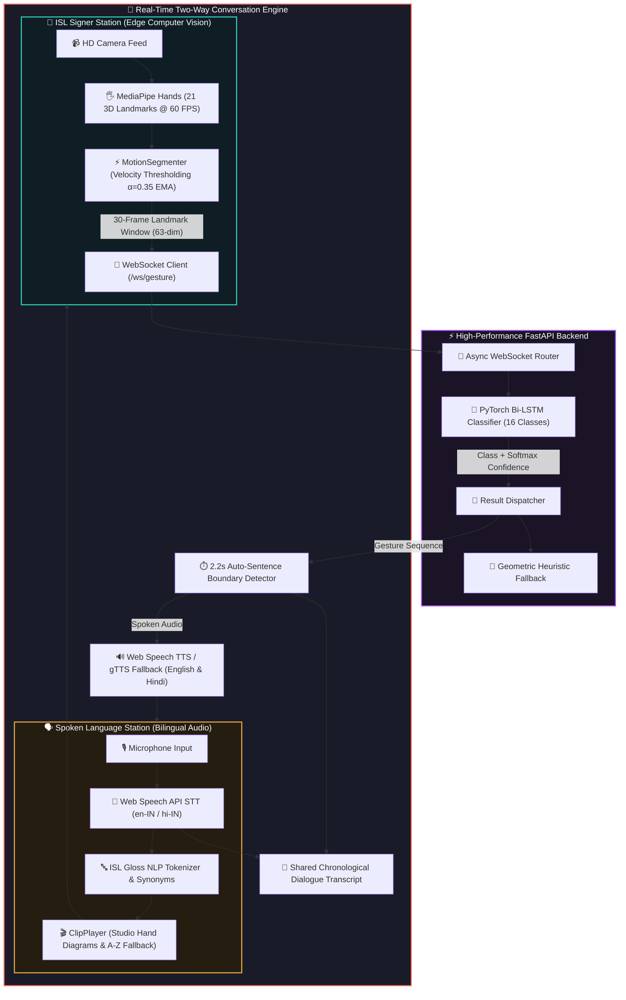

<div align="center">

# 🤟 SignBridge AI
### *AI-Powered Real-Time Bidirectional Indian Sign Language (ISL) Platform*

[](https://frontend-rohanpawar0006s-projects.vercel.app/)
[](https://signbridge-ai-qybu.onrender.com/)
[](https://react.dev/)
[](https://fastapi.tiangolo.com/)
[](https://pytorch.org/)
[](https://developers.google.com/mediapipe)
[](https://www.kaggle.com/datasets/ahmedkhanak1995/sign-language-gesture-images-dataset)
[](https://data.mendeley.com/datasets/kcmpdxky7p/1)
[](LICENSE)

<p align="center">
  <a href="#-live-production-deployments"><strong>Explore Live Demo ➔</strong></a> ·
  <a href="#-system-architecture"><strong>Architecture</strong></a> ·
  <a href="#-key-features"><strong>Key Features</strong></a> ·
  <a href="#-datasets--research-foundation"><strong>Datasets & Research</strong></a> ·
  <a href="#-16-sign-isl-vocabulary-catalog"><strong>ISL Catalog</strong></a> ·
  <a href="#-quick-start--local-setup"><strong>Quick Start</strong></a>
</p>

---

</div>

<br/>

## 🌟 Overview

**SignBridge AI** bridges the communication divide between **Indian Sign Language (ISL)** signers and spoken-language individuals in real time. 

Built with **in-browser edge computer vision**, **continuous velocity motion segmentation**, **deep-learning sequence classification (PyTorch Bi-LSTM)**, and **bilingual voice synthesis (English & Hindi)**, SignBridge AI enables natural, low-latency, two-way conversational flow without requiring specialized hardware or wearable sensors.

---

## 🌐 Live Production Deployments

| Component | Platform | Status | URL |
|---|---|:---:|---|
| **Frontend Web Application** | **Vercel** | [](https://frontend-rohanpawar0006s-projects.vercel.app/) | [frontend-rohanpawar0006s-projects.vercel.app](https://frontend-rohanpawar0006s-projects.vercel.app/) |
| **Backend API & WebSocket** | **Render** | [](https://signbridge-ai-qybu.onrender.com/) | [signbridge-ai-qybu.onrender.com](https://signbridge-ai-qybu.onrender.com/) |
| **Interactive API Documentation** | **Swagger UI** | [](https://signbridge-ai-qybu.onrender.com/docs) | [signbridge-ai-qybu.onrender.com/docs](https://signbridge-ai-qybu.onrender.com/docs) |
| **System Health Check** | **Render** | [](https://signbridge-ai-qybu.onrender.com/health) | [signbridge-ai-qybu.onrender.com/health](https://signbridge-ai-qybu.onrender.com/health) |
| **Source Repository & CI/CD** | **GitHub** | [](https://github.com/rohanpawar0006/SignBridge-AI) | [github.com/rohanpawar0006/SignBridge-AI](https://github.com/rohanpawar0006/SignBridge-AI) |

---

## 🏗️ System Architecture



---

## ✨ Key Features

<table>
  <tr>
    <td width="50%" valign="top">
      <h3>🔄 Two-Way Live Conversation Studio</h3>
      <ul>
        <li><strong>Simultaneous Split-Screen:</strong> Signers and speakers interact concurrently in real-time.</li>
        <li><strong>Shared Chronological Transcript:</strong> Color-coded dialogue bubbles with one-click voice and sign replay.</li>
        <li><strong>Audio FIFO Arbitration:</strong> Intelligent queue prevents synthesized speech from talking over active mic input.</li>
      </ul>
    </td>
    <td width="50%" valign="top">
      <h3>🤟 Edge-AI Gesture Recognition (Mode 1)</h3>
      <ul>
        <li><strong>Zero-Lag CV:</strong> 21 3D hand keypoints tracked at 60 FPS in-browser.</li>
        <li><strong>Continuous Motion Segmentation:</strong> Distinguishes natural signing from resting transitions.</li>
        <li><strong>PyTorch Bi-LSTM:</strong> Deep sequence model trained on landmark trajectories with transparent heuristic fallback.</li>
      </ul>
    </td>
  </tr>
  <tr>
    <td width="50%" valign="top">
      <h3>🎬 ISL Visual Synthesis (Mode 2)</h3>
      <ul>
        <li><strong>Studio Hand Demonstrations:</strong> Filled anatomical hand silhouettes with glowing skeletal tracking overlays.</li>
        <li><strong>Two-Panel Playback:</strong> Clear <em>Start Position ➔ End Position</em> demonstration view.</li>
        <li><strong>A–Z Fingerspelling:</strong> Out-of-vocabulary terms dynamically trigger letter-by-letter hand poses.</li>
      </ul>
    </td>
    <td width="50%" valign="top">
      <h3>🇮🇳 Bilingual Engine (English & Hindi)</h3>
      <ul>
        <li><strong>Bilingual Speech Recognition:</strong> Dictate in Indian English (<code>en-IN</code>) or Hindi (<code>hi-IN</code>).</li>
        <li><strong>Bilingual Voice Output:</strong> ISL signs vocalize seamlessly in English (<em>"Water"</em>) or Hindi (<em>"पानी"</em>).</li>
        <li><strong>Hinglish & Devanagari Tokenizer:</strong> Recognizes transliterations like <code>namaste</code>, <code>madad</code>, <code>paani</code>.</li>
      </ul>
    </td>
  </tr>
  <tr>
    <td width="50%" valign="top">
      <h3>📚 Interactive ISL Dictionary & Library</h3>
      <ul>
        <li><strong>52+ Catalog Entries:</strong> Covers Alphabets (A–Z), Digits (0–9), and Phrases with search-as-you-type and category filters.</li>
        <li><strong>Anatomical Guidance:</strong> Detailed motion descriptions, Hindi/English translations, and continuous sentence flows.</li>
        <li><strong>One-Click Practice Launch:</strong> Jump straight from any dictionary card into live AI camera practice.</li>
      </ul>
    </td>
    <td width="50%" valign="top">
      <h3>⚡ On-Device 36-Class Classifier & HUD</h3>
      <ul>
        <li><strong>Geometric Landmark Engine:</strong> Fast client-side classification across A–Z and 0–9 with disambiguation modes.</li>
        <li><strong>10-Frame Confidence Smoothing:</strong> Majority-voted sliding buffer for rock-solid stability.</li>
        <li><strong>Live Prediction HUD:</strong> Shows locked/stabilizing states and Top-3 candidate probabilities.</li>
      </ul>
    </td>
  </tr>
  <tr>
    <td width="50%" valign="top">
      <h3>✍️ Sentence Tray with Auto-Append</h3>
      <ul>
        <li><strong>Hold-to-Append (1.2s):</strong> Steady sign poses auto-append with an animated countdown progress meter.</li>
        <li><strong>Vocalization & Clipboard:</strong> One-click text-to-speech, backspace, space, clear, and clipboard copy.</li>
        <li><strong>Real-Time Analytics:</strong> Live character and word count tracking.</li>
      </ul>
    </td>
    <td width="50%" valign="top">
      <h3>🏆 Gamified Quiz Mode & Mascots</h3>
      <ul>
        <li><strong>Interactive Challenge:</strong> Streak multipliers and XP scoring (+100 XP + streak bonus).</li>
        <li><strong>Celebratory Confetti:</strong> Particle bursts via <code>canvas-confetti</code> on verified hold match.</li>
        <li><strong>Animated Mascots:</strong> <em>Tally</em>, <em>Blip</em>, and <em>Nudge</em> provide real-time guidance tips.</li>
      </ul>
    </td>
  </tr>
  <tr>
    <td width="50%" valign="top">
      <h3>📸 Sign Capture Studio (<code>#/capture</code>)</h3>
      <ul>
        <li><strong>In-Browser Webcam Recording:</strong> Capture custom hand poses with a 3-second countdown timer.</li>
        <li><strong>Storage & Portability:</strong> Persists to <code>localStorage</code> with complete JSON export/import.</li>
      </ul>
    </td>
    <td width="50%" valign="top">
      <h3>🎨 Modern Responsive UI System</h3>
      <ul>
        <li><strong>Glassmorphic Dark & Light Modes:</strong> Deep ink aesthetics, neon glows, and light mode support.</li>
        <li><strong>Animated SVG Kinematics:</strong> Dynamic Bridge canvas with traveling directional pulses.</li>
        <li><strong>Responsive Mobile Drawer:</strong> Seamless navigation across smartphones, tablets, and desktops.</li>
      </ul>
    </td>
  </tr>
</table>

---

## 🎯 16-Sign ISL Vocabulary Catalog

<div align="center">

| # | Gloss | Category | Hindi | Motion & Handshape Description |
|:---:|:---:|:---:|:---:|---|
| 1 | **`I`** | Pronoun | मैं | Index finger points inward toward chest center |
| 2 | **`WANT`** | Verb | चाहिए | Both hands open palms-up pulling inward with clawing fingers |
| 3 | **`WATER`** | Noun | पानी | W-handshape (3 middle fingers) tapping chin/mouth twice |
| 4 | **`HELP`** | Action | मदद | Thumbs-up fist resting on flat palm lifting upward |
| 5 | **`THANK YOU`** | Courtesy | धन्यवाद | Flat open hand touching chin/lips and extending forward |
| 6 | **`YES`** | Affirmation | हाँ | Closed fist with thumb extended nodding vertically from wrist |
| 7 | **`NO`** | Negation | नहीं | Index and middle fingers snapping down firmly onto thumb |
| 8 | **`PLEASE`** | Courtesy | कृपया | Flat palm rubbing clockwise circle over the heart |
| 9 | **`HELLO`** | Greeting | नमस्ते | Open flat hand waving outward in a polite salute arc |
| 10 | **`FRIEND`** | Noun | दोस्त | Hooked index fingers interlocked and linked twice |
| 11 | **`FOOD`** | Noun | खाना | Fingertips clustered together (O-hand) tapping mouth |
| 12 | **`GOOD`** | Courtesy | अच्छा | Flat hand brushing chin forward with affirmative thumb |
| 13 | **`SORRY`** | Courtesy | माफ़ कीजिए | Closed fist rubbing circular motion on chest |
| 14 | **`TIME`** | Temporal | समय | Index finger tapping opposite wrist watch |
| 15 | **`NAME`** | Identity | नाम | Two-finger H-handshape tapping across each other |
| 16 | **`STOP`** | Command | रुको | Flat vertical palm chopping downward into horizontal palm |

</div>

---

## 📚 Datasets & Research Foundation

SignBridge AI is built on rigorous academic and empirical research benchmarks:

| Dataset | Type & Focus | Scale & Modality | Reference / Source |
|---|---|---|---|
| **ISL-CSLTR** | **Continuous Sentence Translation & Recognition** | 700 continuous videos, 18,863 frames, 1,036 word images across 100 sentences & 7 native signers | [Mendeley Data (kcmpdxky7p/1)](https://data.mendeley.com/datasets/kcmpdxky7p/1) · Funded by SERB, Govt. of India (SRG/2019/001338) |
| **Kaggle ISL Dataset** | **Isolated Vocabulary & Keyframe Demonstrations** | 16 core conversational signs, start/end keyframe posture pairs | [Kaggle ISL Dataset](https://www.kaggle.com/datasets/ahmedkhanak1995/sign-language-gesture-images-dataset) |
| **Soumya ISL Fingerspelling** | **Alphabet (A–Z) & Counting (0–9)** | 36 static classes, 512x512 CLAHE-enhanced handshapes | [Kaggle Soumya ISL](https://www.kaggle.com/datasets/soumyadipghorai/indian-sign-language-dataset) |

### 📥 Automated Dataset Download
To download and extract the full **8.49 GB ISL-CSLTR continuous dataset**, run:
```bash
# Downloads and extracts ISL_CSLRT_Corpus.zip with resumable streaming
python scripts/download_isl_csltr.py

# Extracts 30-frame MediaPipe landmark sequences from continuous videos
python scripts/extract_csltr_dataset.py
```

---

## ⚡ Quick Start & Local Setup

### 📋 Prerequisites
- **Node.js** `>= 18.0.0`
- **Python** `>= 3.10`
- **Webcam & Microphone** for live testing

### 1️⃣ Clone the Repository
```bash
git clone https://github.com/rohanpawar0006/SignBridge-AI.git
cd SignBridge-AI
```

### 2️⃣ Backend Setup (FastAPI & PyTorch)
```bash
# Navigate to backend directory
cd backend

# Install dependencies
pip install -r requirements.txt

# Start FastAPI server with live reload
python main.py
```
> 🚀 Backend runs locally at **`http://localhost:8000`** (Interactive Swagger docs: **`http://localhost:8000/docs`**).

### 3️⃣ Frontend Setup (Vite & React 19)
```bash
# Open a new terminal in the project root
cd frontend

# Install Node dependencies
npm install

# Start Vite development server
npm run dev
```
> 🌐 Frontend runs locally at **`http://localhost:5173`**.

### 4️⃣ Run Automated Test Suite
```bash
# Run backend REST, Model, and WebSocket tests
python backend/test_backend.py

# Run ML model classification evaluation
python scripts/evaluate_model.py
```

---

## 📡 REST API & WebSocket Reference

| Method | Route | Description |
|:---:|---|---|
| **`GET`** | `/health` | System health, model weights status, and active vocabulary count |
| **`GET`** | `/api/vocab` | Full 16-sign catalog metadata, categories, and descriptions |
| **`GET`** | `/api/clips` | Visual sign assets and gesture demonstration registry |
| **`POST`** | `/api/tts` | Multilingual Google TTS fallback audio stream (`en-IN` / `hi-IN`) |
| **`WS`** | `/ws/gesture` | Bi-directional streaming endpoint for 30-frame landmark sequences |

---

## 📁 Repository Structure

```
SignBridge-AI/
├── .github/workflows/ci.yml     # Automated CI/CD pipeline (backend tests + frontend build)
├── dataset/                     # 960 30-frame landmark sequences across 16 ISL classes
├── scripts/
│   ├── download_isl_csltr.py    # Automated 8.49 GB Mendeley ISL-CSLTR dataset downloader
│   ├── extract_csltr_dataset.py # MediaPipe landmark sequence extractor from continuous videos
│   ├── generate_hd_studio_dataset.py # Studio-grade filled hand silhouette asset generator
│   ├── extract_kaggle_dataset.py# Landmark extractor from raw ISL clips
│   ├── collect_dataset.py       # Dataset generator (synthetic & camera collection)
│   ├── train_lstm.py            # PyTorch Bi-LSTM training script
│   └── evaluate_model.py        # Model evaluation & classification report script
├── backend/
│   ├── requirements.txt         # FastAPI, uvicorn, websockets, torch, numpy, gTTS
│   ├── main.py                  # FastAPI application entrypoint with CORS & routers
│   ├── test_backend.py          # Automated test suite (/health, /api/vocab, /ws/gesture)
│   ├── Dockerfile               # Production container definition
│   └── app/
│       ├── config.py            # 16-sign vocabulary, sliding window params, thresholds
│       ├── models/
│       │   ├── lstm_model.py    # PyTorch ISLGestureLSTM (Input: 63, Hidden: 128, Classes: 16)
│       │   └── model_weights/   # isl_lstm.pth trained model weights (2.44 MB)
│       ├── routers/
│       │   ├── gesture_ws.py    # WebSocket streaming endpoint (/ws/gesture)
│       │   ├── clips.py         # REST catalog endpoints (/api/vocab, /api/clips)
│       │   └── speech.py        # REST TTS fallback endpoint (/api/tts)
│       └── services/
│           ├── gesture_classifier.py # Window classifier, PyTorch inference, heuristic fallback
│           └── clip_service.py       # Catalog query service
└── frontend/
    ├── package.json             # React 19, Vite, @mediapipe/hands, canvas-confetti
    ├── vite.config.js           # Vite dev proxy configuration for /api and /ws
    ├── vercel.json              # Vercel SPA routing rewrites
    └── src/
        ├── index.css            # Modern design tokens, glassmorphism, responsive styles
        ├── assets/signs/        # 68 HD Studio hand demonstrations (A-Z, 0-9, 16 Phrases)
        ├── components/
        │   ├── Navbar.jsx       # Frosted glass header, GitHub link, mobile drawer, theme toggle
        │   ├── Hero.jsx         # Hero section with interactive CTA
        │   ├── BridgeCanvas.jsx # Signature animated SVG bridge with directional pulse
        │   ├── ConversationMode.jsx # Live two-way conversation split-screen studio
        │   ├── SignToSpeech.jsx # Mode 1: Continuous conversational detection, HUD, tray
        │   ├── SpeechToSign.jsx # Mode 2: Mic input, tokenizer, gloss chips, clip player
        │   ├── SignDictionary.jsx # Interactive 52+ catalog with search & category filters
        │   ├── PracticeStudio.jsx # Quiz challenge mode, streak bonus, confetti, mascots
        │   ├── PredictionHUD.jsx# Real-time Top-3 candidate distribution HUD
        │   ├── SentenceTray.jsx # Auto-append on hold sentence builder tray
        │   ├── MascotGuides.jsx # Animated Tally, Blip, Nudge SVG mascots & tip cards
        │   ├── ClipPlayer.jsx   # Sequenced sign player with real HD hand photos
        │   ├── CaptureStudio.jsx# Custom webcam hand pose capture tool
        │   └── SignVectorVisualizer.jsx # Custom SVG kinematics for 16 ISL signs
        ├── services/
        │   ├── islModel.js      # On-device 36-class geometric classifier
        │   ├── mediapipe.js     # MediaPipe Hands client-side tracking service
        │   ├── websocket.js     # WebSocket client with auto-reconnection
        │   └── speech.js        # Web Speech API (STT & TTS en-IN / hi-IN / en-US fallback)
        └── utils/
            ├── smoothing.js     # 10-frame confidence smoothing buffer
            ├── motionSegmenter.js # Real-time conversational gesture velocity segmenter
            ├── islDictionary.js # Tokenizer, CSLTR continuous sentences & Hindi mappings
            └── signPhotos.js    # Bundled asset loader & localStorage capture store
```

---

## 📄 License

This project is open-source and licensed under the **[MIT License](LICENSE)**.

<div align="center">

**SignBridge AI** · *Bridging Signs and Speech with Applied AI*

</div>
